# Loan enrollment onboarding + seven compliance requirements (Accessibility last)

## Policy (confirmed)

- **Soft gate**: Borrowers **can finish** loan request submission, contract acceptance, device admin activation, and dashboard access even if not every compliance item is green yet.
- The app should **guide** users so that, by the end of enrollment, they have **checked off all seven** requirements used in [`MdmComplianceCollector`](../app/src/main/java/com/kopanow/MdmComplianceCollector.kt) (`requiredFlags`, seven items).
- **Accessibility must be the last step** in the guided order (step 7), after the other six are presented and can be completed first—this matches sideload/Samsung reality (restricted settings) and avoids blocking earlier steps.

## The seven requirements (source of truth)

From [`MdmComplianceCollector.collect()`](../app/src/main/java/com/kopanow/MdmComplianceCollector.kt) lines 69–78, the seven flags that define `allRequiredOk` are:

| Order in code (collector) | Field | User-facing step (guided order) |
|---------------------------|-------|----------------------------------|
| 1 | `deviceAdmin` | **Step 1** — Device administrator |
| 2 | `accessibilityService` | **Step 7** — Accessibility (last) |
| 3 | `displayOverOtherApps` | **Step 3** — Display over other apps |
| 4 | `notificationsEnabled` | **Step 2** — Notifications (+ POST_NOTIFICATIONS on API 33+) |
| 5 | `batteryOptimizationIgnored` | **Step 4** — Battery unrestricted |
| 6 | `usageStatsGranted` | **Step 5** — Usage access |
| 7 | `canScheduleExactAlarms` | **Step 6** — Exact alarms |

**Guided UX order (implementation):** present steps **1 → 2 → 3 → 4 → 5 → 6 → 7** so **Accessibility is always last**, while still computing `allRequiredOk` from the same seven booleans (order in code/collector unchanged; only UI order changes).

Suggested mapping:

1. **Device administrator** — `DeviceSecurityManager` / enrollment flow (`EnrollmentManager.requestDeviceAdmin`).
2. **Notifications** — `NotificationManagerCompat`, `POST_NOTIFICATIONS` on Tiramisu+.
3. **Display over other apps** — `Settings.canDrawOverlays` → `ACTION_MANAGE_OVERLAY_PERMISSION`.
4. **Battery: unrestricted** — `PowerManager.isIgnoringBatteryOptimizations` → intent to app details or `ACTION_IGNORE_BATTERY_OPTIMIZATION_SETTINGS` / request ignore as appropriate.
5. **Usage access** — `AppOpsManager.OPSTR_GET_USAGE_STATS` → `Settings.ACTION_USAGE_ACCESS_SETTINGS`.
6. **Exact alarms** — `AlarmManager.canScheduleExactAlarms` (API 31+) → `Settings.ACTION_REQUEST_SCHEDULE_EXACT_ALARM` or settings.
7. **Accessibility (Kopanow service)** — `Settings.Secure.ENABLED_ACCESSIBILITY_SERVICES` (same matching as today) → `ACTION_ACCESSIBILITY_SETTINGS`, App info for **Allow restricted settings** on Android 13+.

`fcmTokenPresent` and `fullScreenIntentAllowed` remain **informational** in payload but are **not** part of the seven `requiredFlags` (per existing collector).

## Current state

- [`MdmComplianceCollector`](../app/src/main/java/com/kopanow/MdmComplianceCollector.kt) already implements detection for all seven; `isAccessibilityEnabled()` is private.
- [`MainActivity`](../app/src/main/java/com/kopanow/MainActivity.kt) shows `MdmComplianceCollector.formatChecklistLines(p)` in `tvMdmChecklist` and refreshes ~every 900ms (`refreshMdmComplianceUi`).
- Loan request lives in [`RegistrationActivity`](../app/src/main/java/com/kopanow/RegistrationActivity.kt); contract in [`ContractActivity`](../app/src/main/java/com/kopanow/contract/ContractActivity.kt); activation on [`MainActivity`](../app/src/main/java/com/kopanow/MainActivity.kt).

## Implementation plan

### 1) Centralize Accessibility check

- Public `isKopanowAccessibilityServiceEnabled(context)` on `MdmComplianceCollector` (refactor private method); `collect()` uses it.

### 2) Single “compliance step” model (ordered for UI)

- Add a small data structure, e.g. `enum` or sealed class `ComplianceStep` with: `id`, `labelRes`, `isSatisfied(Context)`, `launchSettingsIntent(Context)` (where applicable).
- **UI order**: 1–7 as in the table above (Accessibility last).
- Reuse existing collector logic—either call `collect()` once and read fields, or expose per-check functions to avoid duplicating logic.

### 3) Guided onboarding **throughout loan enrollment**

- **Phase A — Registration / loan request** ([`RegistrationActivity`](../app/src/main/java/com/kopanow/RegistrationActivity.kt)): optional compact banner or first screen note: “After loan approval you will complete device setup (7 steps).” Avoid heavy settings here; keep focus on form fields.
- **Phase B — Contract** ([`ContractActivity`](../app/src/main/java/com/kopanow/contract/ContractActivity.kt)): optional one-line reminder only (no blocking)—contract text is already long.
- **Phase C — Main / activation** ([`MainActivity`](../app/src/main/java/com/kopanow/MainActivity.kt)): primary surface for the **step-by-step checklist**:
  - Show progress **Step X of 7** (Accessibility is step 7).
  - For each incomplete step: primary button opens the right Settings screen (intents above).
  - **Step 7** includes expandable **Need help?** for Android 13+ **Allow restricted settings** + turn on KopaNow service; support phone from strings if present.
- On **`onResume`**, refresh step completion from `MdmComplianceCollector.collect()`.

### 4) Soft completion

- Do **not** block loan submission or contract if steps incomplete.
- After admin + register, show dashboard; checklist remains until all seven green (or user dismisses with “I’ll finish later” if product allows—default: persistent banner until `allRequiredOk`).

### 5) Strings and copy

- One string block per step (title + short why).
- Step 7: restricted-settings path, Samsung disclaimer if ⋮ missing.

### 6) Backend

- No schema change; heartbeat already sends `mdm_compliance`.

## Files to touch (expected)

- [`app/src/main/java/com/kopanow/MdmComplianceCollector.kt`](../app/src/main/java/com/kopanow/MdmComplianceCollector.kt) — public accessibility helper; optional helpers or step registry.
- [`app/src/main/java/com/kopanow/MainActivity.kt`](../app/src/main/java/com/kopanow/MainActivity.kt) — replace or augment plain checklist with ordered guided UI + intents.
- [`app/src/main/res/layout/activity_main.xml`](../app/src/main/res/layout/activity_main.xml) — progress + step list / buttons.
- Optionally [`RegistrationActivity`](../app/src/main/java/com/kopanow/RegistrationActivity.kt) — lightweight “what comes next” copy.
- [`app/src/main/res/values/strings.xml`](../app/src/main/res/values/strings.xml) — all step copy.

## Flow (mermaid)

```mermaid
flowchart LR
  loan[Loan request]
  contract[Contract]
  main[Main activation]
  s1[Step1 DeviceAdmin]
  s2[Step2 Notifications]
  s3[Step3 Overlay]
  s4[Step4 Battery]
  s5[Step5 Usage]
  s6[Step6 Alarms]
  s7[Step7 Accessibility]
  loan --> contract --> main
  main --> s1 --> s2 --> s3 --> s4 --> s5 --> s6 --> s7
```

## Original Cursor plan location

`c:\Users\casto\.cursor\plans\accessibility_onboarding_detection_7fb4974e.plan.md`
